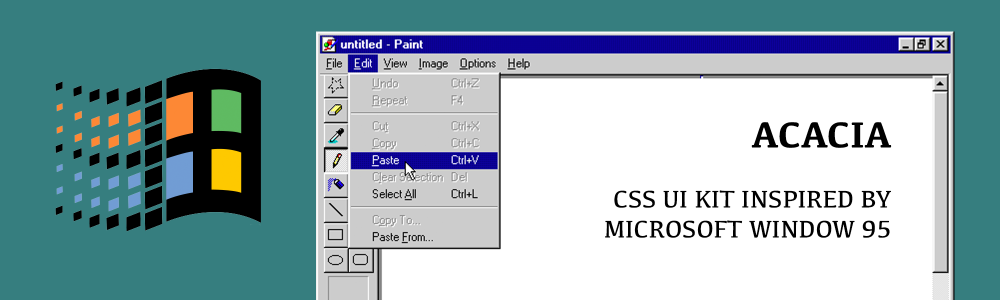

<p align="center">
  	
</p>
<p align="center">An Easy-to-use CSS UI KIT inspired by 📺 Microsoft Window 95</p>
<div align="center">
  <a href="https://github.com/chunza2542/acacia/blob/master/LICENSE">
    
  </a>
</div>

## Feature Requst & Issue
Checkout this link https://github.com/chunza2542/acacia/issues,

## Installation
Download `dist` folder to your project directory, then put this code inside you `head` tag.
```html
<link rel="stylesheet" href="path/to/your/acacia.min.css">
```
### Example
This code showing an example of Copying Files panel
```html
<div class="aca-panel">
    <div class="header">Copying Files...</div>
    <div class="body">
      Source:<br>
      L:\COMMON\CLIENT32\WIN95\MAIN<br>
      Destination:<br>
      C:\WINDOW<br><br>
      <div class="aca-progress">
          <div style="width: 35%;" class="aca-progress-bar"></div>
      </div>
      <br>
      <center>
          <button class="aca-button">Cancel</button>
      </center>
    </div>
</div>
```

## Documentation

### Button
- __aca-button__ - MS WIN95 Button class
- __suggesstion__ - Suggestion Button
- __aca-button-link__ - Button for Link Button or `link` tag
```html
<button class="aca-button suggestion">OK...</button>
<button class="aca-button">Cancel...</button>
<button class="aca-button">Browse...</button>
<button class="aca-button-link">Open in browser</button>
```

### Input
- __aca-text-field__ - MS WIN95 Text Field class
- __aca-select__ - MS WIN95 Select Input class
- __aca-checkbox__ - MS WIN95 Checkbox Input class (Experiment)
- __aca-radio__ - MS WIN95 Radio Input class (Experiment)
```html
<input type="text" class="aca-text-field" placeholder="Example...">

<select class="aca-select">
	<option value="">Bangkok</option>
 	<option value="">This is a very long text</option>
</select>
```

### Progress Bar
- __aca-progress__ - MS WIN95 Progress Bar
- __aca-progress-bar__ - Progress Bar use inside class `aca-progress`
```html
<div class="aca-progress">
	<div style="width: 35%;" class="aca-progress-bar"></div>
</div>
```

### Panel
- __aca-panel__ - MS WIN95 Panel Container
- __header__ - Header Tab use inside class `aca-panel`
- __body__ - Header Tab use inside class `aca-panel`
- __footer__ - Footer Tab use inside class `body`
```html
<div class="aca-panel">
    <div class="header">Heading</div>
    <div class="body">
    	Something...
		<div class="footer">
        	<button class="aca-button suggestion">OK</button>
            <button class="aca-button">Cancel</button>
            <button class="aca-button">Browse...</button>
       	</div>
    </div>
</div>
```


## Contribution Guide
1. Fork & clone this repository to your local directory
```bash
git clone https://github.com/chunza2542/acacia.git
```
2. Run project in development environment
```bash
yarn dev # this will run gulp development task
```
3. After finish updating, Send pull request to this repo.
4. That's it!

<hr>
Made with <3 by Chun Rapeepat @chunza2542, Codebase from [Biomatic CSS Framework](https://github.com/BioMaRu/biomatic), Thank.

